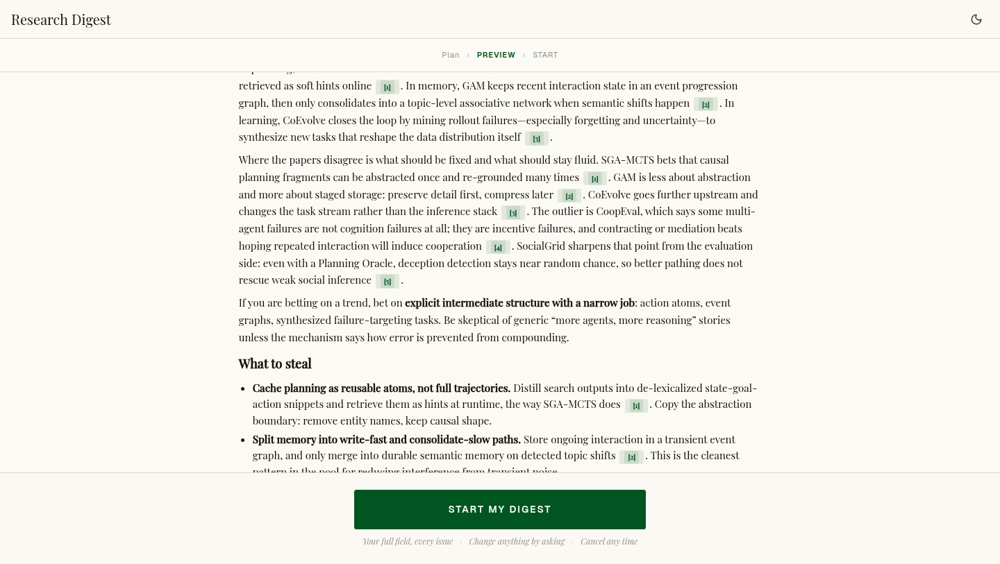
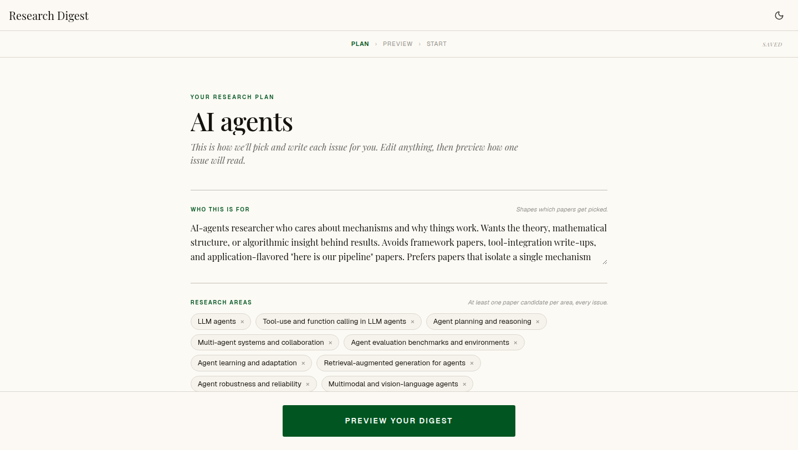
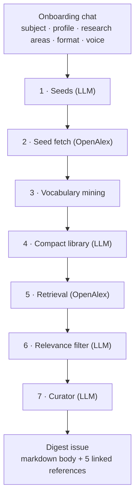

<div align="center">

# Research Digest

**A personal research digest that reads the week's papers for you and writes one issue in your voice.**

Describe what you want to track, once, in a conversation. Every issue after that is retrieved, filtered, and written for you against a plan you can edit.

[](LICENSE)
[](https://nextjs.org)
[](tsconfig.json)
[](https://openalex.org)

[Quickstart](#quickstart) · [How it works](#how-it-works) · [The evidence](#the-evidence) · [Configuration](#configuration) · [Status](#status)

</div>

---

Most paper alerts give you a keyword match and a list of titles. This gives you an editorial: what changed in your field this week, how the papers connect, and what any of it means for your work. Five picks, with citations you can click.

<p align="center">
  
</p>

The digest is written from a **research plan** you own and can edit at any time: who you are, which areas to track, how each issue should be structured, and how it should sound.

<p align="center">
  
</p>

## Why this exists

Research moves faster than any one person can read. Topic feeds respond by widening the net, which buries you, or by narrowing it to a keyword, which misses the specific angles you actually care about.

The bet here is that the quality ceiling is set at **onboarding**, not at retrieval. If the system knows that you are a mechanism-focused researcher who skips framework papers, it can build search queries in your field's real vocabulary, drop the noise, and write the issue for you rather than at you. A prior prototype built on OpenAlex topic IDs and prompt-time keyword extraction proved too coarse; an [8-version iteration study](iter/ITERATION_LOG.md) across 4 reader profiles found the architecture that replaced it. This repo is that rewrite.

## How it works

Seven steps, four LLM calls, one paper source. Nothing is hardcoded to a field.



| Step | What it does | Window |
| --- | --- | --- |
| **1 · Seeds** | Writes 3 to 5 broad seed queries, merged with seeds derived from your research areas so the miner has to read papers that name your actual methods | |
| **2 · Seed fetch** | Pulls up to 50 papers per seed to sample how your field is really indexed | last 180 days |
| **3 · Vocabulary mining** | Counts topics, keywords, subfields and journals across the sample. Pure aggregation, no model call | |
| **4 · Compact library** | Writes exactly one query per research area in that mined vocabulary, plus umbrella queries parsed from the subject | |
| **5 · Retrieval** | Runs the library in parallel, deduped by OpenAlex ID and again by normalized title | last 7 days |
| **6 · Relevance filter** | Scores the pool against your profile and drops off-topic hits before the curator pays for them | |
| **7 · Curator** | Picks 5 and writes the issue in your format and voice | |

Orchestration lives in [`src/lib/ai/preview/pipeline.ts`](src/lib/ai/preview/pipeline.ts).

Progress streams to the browser over SSE, so the UI shows real counts as each stage lands rather than a spinner.

### The contracts that keep it honest

These are enforced in code and prompts, and they are the reason the output stays personal instead of drifting into a generic summary:

| Contract | Where | Why |
| --- | --- | --- |
| The filter reads **only** `profile`. The curator reads **only** `format_structure` + `voice_language`. | [`filter.ts`](src/lib/ai/preview/filter.ts), [`curator.ts`](src/lib/ai/preview/curator.ts) | Voice preferences must never change which papers get picked, and vice versa. |
| Every research area produces **at least one query** per run. | [`build-library.ts`](src/lib/ai/discovery/build-library.ts) | An area you asked for should never be silently dropped. |
| `[n]` citations index the curator's own reference list, never pool positions. | [`prompts/preview-curator-system.md`](prompts/preview-curator-system.md) | Off-by-one citations render as dead chips in the UI. |
| The filter and curator degrade rather than fail. | [`pipeline.ts`](src/lib/ai/preview/pipeline.ts) | A filter that keeps fewer than 3 papers falls back to the unfiltered pool; a failed curator falls back to the five most recent. |

## Quickstart

**Requirements:** Node 20.9+, an [OpenRouter](https://openrouter.ai) API key, and an email address for the [OpenAlex polite pool](https://docs.openalex.org/how-to-use-the-api/rate-limits-and-authentication#the-polite-pool).

```bash
git clone https://github.com/aykutuysal/Personalized-Research-Digest.git
cd Personalized-Research-Digest
npm install
cp .env.local.example .env.local   # then fill in the two required values
npm run dev
```

Open [http://localhost:3000](http://localhost:3000), describe what you want to track, and follow the conversation through to a preview issue.

A preview run costs roughly **$0.05** at the default models, nearly all of it in the curator. OpenAlex is free. End to end it takes one to two minutes; the library and filter calls dominate the wall clock, not the curator.

## Configuration

Two variables are required:

| Variable | Required | Notes |
| --- | --- | --- |
| `OPENROUTER_API_KEY` | yes | All LLM calls route through OpenRouter. |
| `OPENALEX_MAILTO` | yes | Your email, sent with every OpenAlex request for the polite pool. |
| `OPENALEX_API_KEY` | no | Higher OpenAlex rate limits. |

Every pipeline stage picks its own model, so you can trade cost against quality per stage without touching code. Each falls back to `OPENROUTER_DEFAULT_MODEL_ID`, which itself defaults to `deepseek/deepseek-v3.2`.

| Variable | Default | Stage |
| --- | --- | --- |
| `OPENROUTER_DEFAULT_MODEL_ID` | `deepseek/deepseek-v3.2` | Fallback for everything below |
| `OPENROUTER_ONBOARDING_MODEL_ID` | default | The onboarding chat |
| `OPENROUTER_PROPOSAL_MODEL_ID` | default | Proposing 6 to 12 research areas |
| `OPENROUTER_SEEDS_MODEL_ID` | default | Step 1, seed queries |
| `OPENROUTER_LIBRARY_MODEL_ID` | default | Step 4, the query library |
| `OPENROUTER_FILTER_MODEL_ID` | default | Step 6, relevance filtering |
| `OPENROUTER_CURATOR_MODEL_ID` | `openai/gpt-5.4` | Step 7, writing the issue |

The curator is the one stage that defaults to a premium model, [for measured reasons](#the-evidence).

> [!NOTE]
> If you point any stage at an `anthropic/*` model, strip `min`/`max`/`length` constraints from that stage's Zod schema first. The AI SDK does not transform them the way the official Anthropic SDK does. See the comments in [`propose-research-areas.ts`](src/lib/ai/propose-research-areas.ts).

## The evidence

Most of the design here came out of measurement rather than intuition, and the artifacts are in the repo so you can check the reasoning or rerun it.

**[`iter/`](iter/ITERATION_LOG.md) — the query-planner iteration study.** 8 prompt versions scored across 4 reader profiles chosen to stress different vocabulary regimes: LLM agents (rich vocabulary), marketing (heavy polysemy), atrial fibrillation (clinical), adolescent depression (narrow compound subject). Total spend: ~$1.94. The harness, the profiles, the per-run artifacts and the full log are all in the repo. What it settled:

- Widening a query's anchor to a broader field is catastrophic when that field out-publishes the narrow subject. Marketing went from 56% to 13% healthy queries on this change alone.
- Phrase-only anchors work for rich-vocabulary fields and starve recall for compound subjects. There is no single query pattern that works everywhere, which is why the planner selects a pattern by subject type.
- Deduplicating hits and filtering by work type were worth more than several prompt revisions combined. The type filter alone moved marketing precision by 15 points.

**[`experiments/`](experiments/) — the curator sweeps.** Per-model outputs, summaries, and notes, reproducible from the gated tests in [`test/`](test/):

- **16 models swept** through the curator on a fixed pool. 15 returned a valid object; total cost $0.47. `openai/gpt-5.4` gave the best editorial synthesis at $0.056 and 25 seconds.
- **`deepseek/deepseek-v3.2` is ~10x cheaper** and looked compliant at N=1, but an N=3 × 2-profile A/B showed the citation contract breaking in 4 of 6 runs: dead chips from pool-position citations, a 6-item reference list, meta-voice leaks. The cheap model is a documented fallback, not the default, until a server-side citation validator lands.
- **Several models fail the selection rule outright** and are not worth re-testing: `gpt-5.4-mini` returns 15 papers, `claude-haiku-4.5` returns 8, `gemini-3.1-flash-lite` uses pool-position citations even after prompt tightening.

Prompt-level A/Bs for the situated lede, jargon glossing, and profile differentiation live in the same folder, each with runs, a summary, and notes on what changed.

## Project structure

```
src/
├── app/
│   ├── api/onboarding-chat/     Streaming chat endpoint (AI SDK v6)
│   ├── api/preview-digest/      SSE endpoint that runs the pipeline
│   └── onboarding/              The docked onboarding page
├── components/
│   ├── chat/                    ChatShell owns state + transport
│   ├── stages/                  Plan → Preview → Start
│   └── ui/                      Button, Card, Chip, ThemeToggle
└── lib/
    ├── ai/discovery/            Steps 1-5: seeds, vocab, library, retrieval
    ├── ai/preview/              Steps 6-7 + pipeline orchestration
    ├── openalex/                Polite-pool client with retry + backoff
    ├── config-schema.ts         DigestConfig, the contract for everything
    └── schedule/build-cron.ts   Deterministic cadence → cron, no LLM

prompts/        System prompts, loaded from disk at request time and cached
test/           Vitest; live-API experiments are env-gated
experiments/    Model sweeps and prompt A/Bs, with outputs
iter/           Frozen iteration study. Python and run artifacts, not importable code
docs/           Brief, PRD, design specs, implementation notes
```

Editing a file in `prompts/` changes agent behavior without a code change, which is the point.

## Development

```bash
npm run dev         # Turbopack dev server
npm run build       # production build
npm run lint        # ESLint, flat config
npm run typecheck   # tsc --noEmit, strict
npm test            # Vitest, single run
```

The default suite is 47 tests and runs in about two seconds with no network and no API key. The model sweeps and prompt A/Bs live in the same folder but sit behind their own env flags, so a normal run never spends money:

```bash
RUN_CURATOR_SWEEP=1 npx vitest run test/curator-model-sweep.test.ts
CURATOR_SWEEP_ONLY=openai/gpt-5.4,deepseek/deepseek-v3.2 RUN_CURATOR_SWEEP=1 npx vitest run test/curator-model-sweep.test.ts
RUN_POOL_EXPERIMENT=1 npx vitest run test/pool-experiment.test.ts
```

A few things about this stack that differ from what you may expect:

- **Next.js 16, React 19, AI SDK v6, Tailwind v4.** All four have breaking changes against what most references still describe. Next ships its own docs at `node_modules/next/dist/docs/` after install; read those before writing against Next APIs from memory. `cookies()` and `headers()` are async.
- **AI SDK v6:** `convertToModelMessages` is async, `useChat` takes a `transport`, and the stream response method is `toUIMessageStreamResponse()`. Tool parts are typed `tool-<NAME>` and must be guarded on `part.state === 'output-available'`.
- **`server-only` and Vitest:** server-gated modules import `'server-only'`, which throws under Vitest's default condition. [`vitest.config.ts`](vitest.config.ts) aliases it to the package's empty stub. Do not add `'server-only'` to files that must run in the browser.

More detail in [`AGENTS.md`](AGENTS.md) and [`CLAUDE.md`](CLAUDE.md).

## Status

This is a working slice, not a finished product. What runs today:

- [x] Conversational onboarding that produces a complete research plan
- [x] The full retrieval and curation pipeline, streaming to the browser
- [x] An editable research plan and a real preview issue
- [x] Cadence picking, computed client-side with no LLM call

Not built yet:

- [ ] Persistence and auth (the plan currently lives in `localStorage`)
- [ ] Scheduled runs and email delivery
- [ ] Conversational config editing with version history
- [ ] A server-side citation validator, which would unlock the cheaper curator model

Design decisions, in order: [`docs/2026-04-13-BRIEF.md`](docs/2026-04-13-BRIEF.md), [`docs/2026-04-13-PRD.md`](docs/2026-04-13-PRD.md), and the specs under [`docs/superpowers/`](docs/superpowers/).

## Contributing

Issues and pull requests are welcome. Before opening a PR:

1. `npm run lint && npm run typecheck && npm test` should pass.
2. If you change a prompt, include the A/B that justifies it. `experiments/` shows the format: runs, a summary table, and notes on what changed and why.
3. Keep the schema contracts intact. The filter reads only `profile`; the curator reads only `format_structure` and `voice_language`.

## Acknowledgements

Papers come from [OpenAlex](https://openalex.org), a fully open catalog of the global research system. Model routing is through [OpenRouter](https://openrouter.ai).

## License

[GNU AGPL-3.0](LICENSE). You can run, modify, and self-host this freely. If you offer a modified version to others over a network, you have to publish your changes under the same license.
